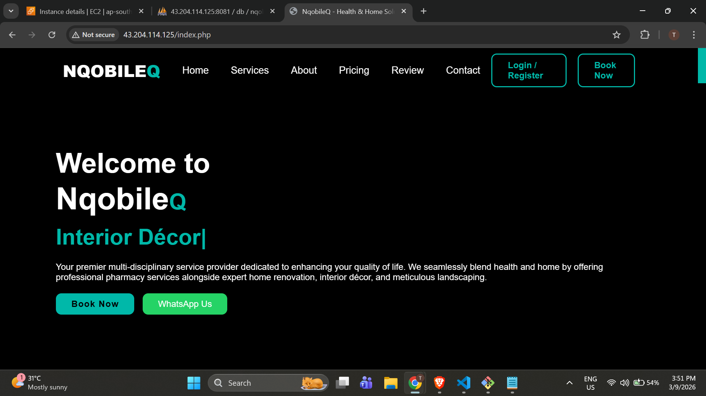
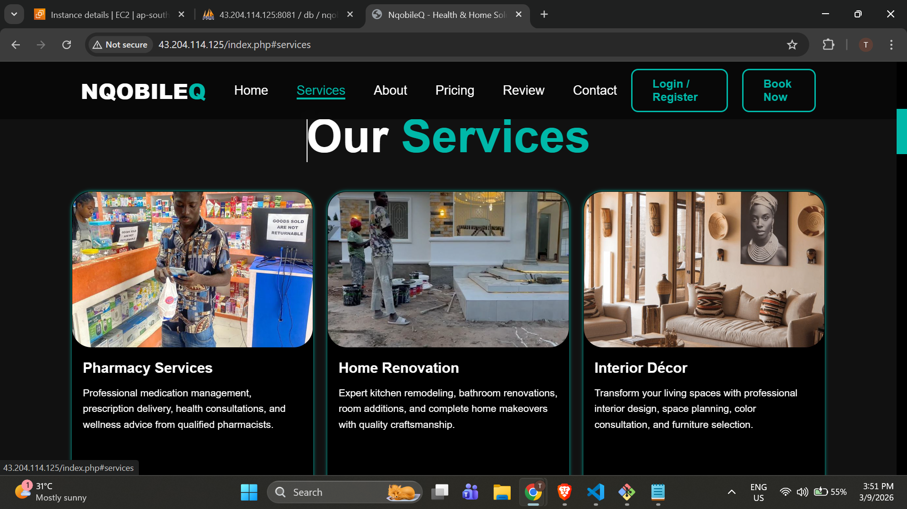
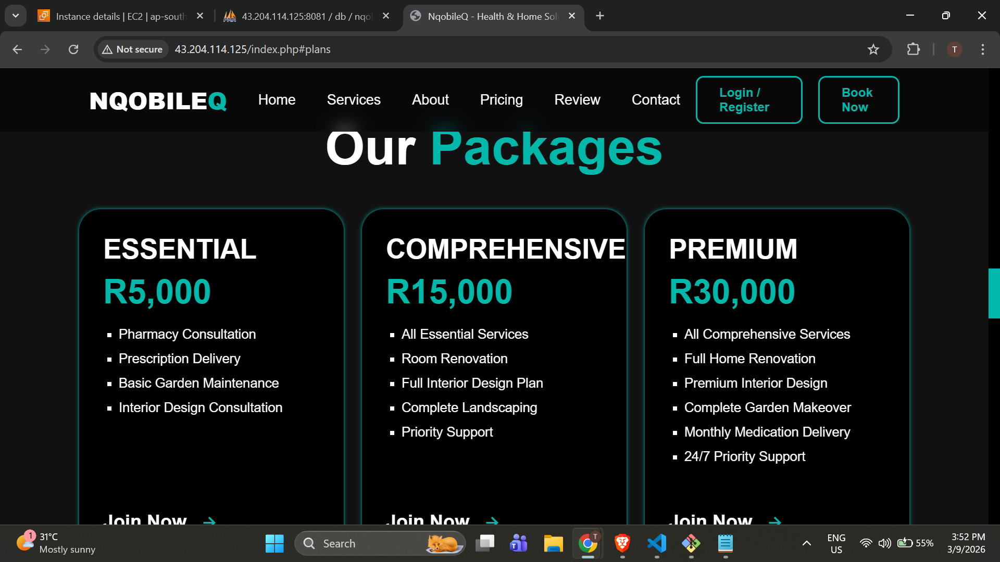
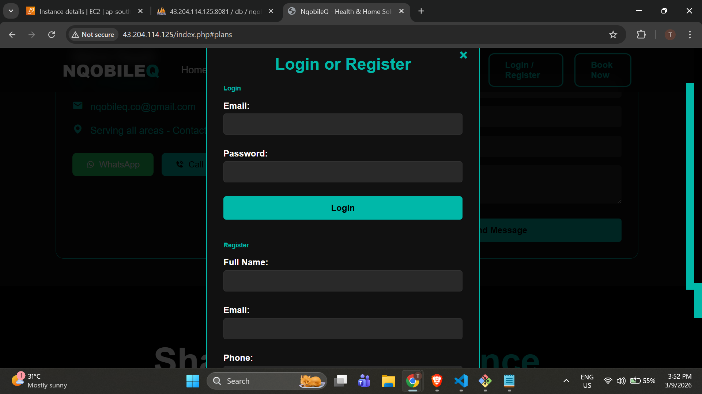
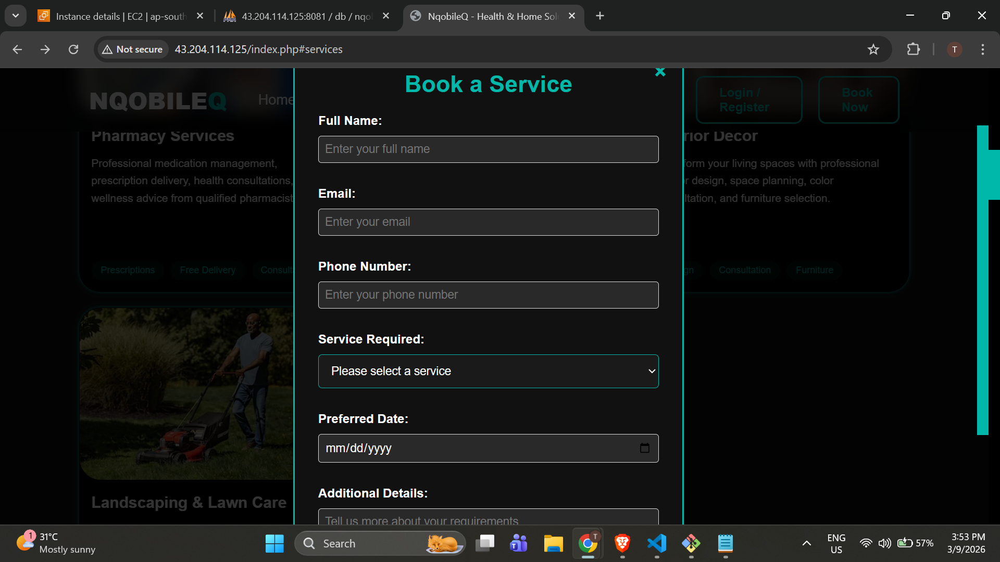
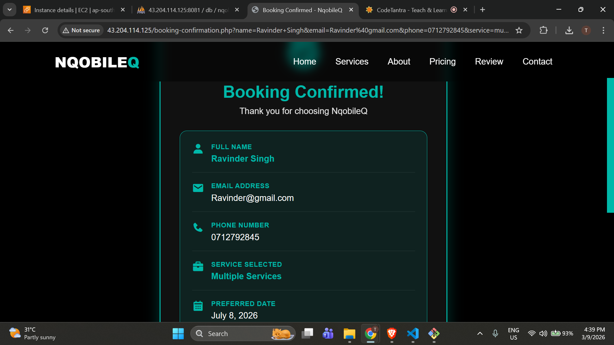
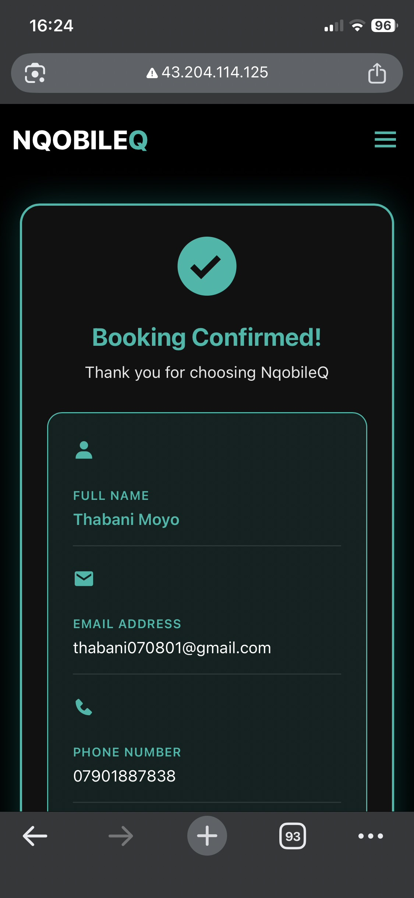

# NqobileQ - Health & Home Solutions

## 🏠 About
NqobileQ is a multi-disciplinary service provider offering:
- 💊 Pharmacy Services
- 🏗️ Home Renovation
- 🎨 Interior Décor
- 🌳 Landscaping & Lawn Care



[](http://43.204.114.125)
[](https://www.docker.com/)
[](https://php.net)
[](https://mysql.com)
[](https://aws.amazon.com)
[](LICENSE)

## 📋 Overview

**NqobileQ** is a multi-disciplinary service provider offering integrated health and home solutions. This platform allows users to book services, subscribe to packages, and manage their accounts seamlessly.

### ✨ Features
- ✅ **User Authentication** - Secure login/register system
- ✅ **Service Booking** - Book pharmacy, renovation, interior, landscaping services
- ✅ **Package Subscriptions** - Essential, Comprehensive, Premium plans
- ✅ **Email Notifications** - PHPMailer integration
- ✅ **WhatsApp Integration** - Direct contact via WhatsApp
- ✅ **Admin Interface** - Manage bookings and inquiries
- ✅ **Responsive Design** - Mobile-friendly UI
- ✅ **Docker Containerized** - Easy deployment

---

## 🚀 Live Demo

| Service | URL | Credentials |
|---------|-----|-------------|
| **Website** | [http://43.204.114.125](http://43.204.114.125) | - |
| **phpMyAdmin** | [http://43.204.114.125:8081](http://43.204.114.125:8081) | root / rootpassword123 |

---

## 📸 Screenshots

### Homepage


### Services Section


### Pricing Packages


### Login Modal


### Booking Form


### Confirmation Page


### Mobile View


---

## 🐳 Docker Setup

### Prerequisites
- Docker
- Docker Compose
- Git

### Quick Start

```bash
# Clone the repository
git clone https://github.com/JasonMoyo/Docker-webs.git
cd Docker-webs

# Build and run with Docker
docker-compose up -d --build

# Access the site
open http://localhost

Docker Commands

# View running containers
docker-compose ps

# View logs
docker-compose logs -f

# Stop containers
docker-compose down

# Restart containers
docker-compose restart

# Access container shell
docker exec -it nqobileq_web bash

Services Architecture

┌─────────────┐     ┌─────────────┐     ┌─────────────┐
│   Website   │────▶│   MySQL     │────▶│  phpMyAdmin │
│   (Port 80) │     │  (Port 3307)│     │ (Port 8081) │
└─────────────┘     └─────────────┘     └─────────────┘
       │                   │                    │
       └───────────────────┴────────────────────┘
                    Docker Network

📁 Project Structure

├── 📁 assets/              # Images and media
├── 📁 vendor/              # Composer dependencies
├── 📁 screenshots/         # Project screenshots
├── 📁 .github/workflows/   # GitHub Actions
├── 📄 Dockerfile           # Docker configuration
├── 📄 docker-compose.yml   # Multi-container setup
├── 📄 init.sql             # Database schema
├── 📄 config.php           # Configuration
├── 📄 index.php            # Main entry point
├── 📄 login.php            # Authentication
├── 📄 register.php         # User registration
├── 📄 script.js            # JavaScript
├── 📄 styles.css           # Styling
├── 📄 .env.example         # Environment template
├── 📄 .gitignore           # Git ignore rules
└── 📄 README.md            # This file

Database Setup

The database auto-initializes with init.sql containing:

Users table

Service bookings

Package bookings

Inquiries

Testimonials

Deployment on AWS EC2
Step 1: Launch EC2 Instance
Ubuntu 22.04 LTS

Security group: Open ports 80, 8081, 22

Step 2: Install Docker

sudo apt update
sudo apt install docker.io docker-compose -y
sudo usermod -aG docker ubuntu
# Reconnect

Step 3: Deploy

git clone https://github.com/JasonMoyo/Docker-webs.git
cd Docker-webs
docker-compose up -d --build

🛠️ Technologies Used
Technology	Purpose
PHP 8.1	Backend logic
MySQL 8.0	Database
Apache	Web server
Docker	Containerization
AWS EC2	Cloud hosting
HTML5/CSS3	Frontend
JavaScript	Interactivity
PHPMailer	Email sending
vlucas/phpdotenv	Environment config

## 📞 Contact

<div align="center">
  
[](https://wa.me/+27782280408)
[](https://www.facebook.com/profile.php?id=61588428180925)
[](https://www.instagram.com/nqobileq_services_/)
[](mailto:nqobileq.co@gmail.com)

**Phone:** [+27782280408](tel:+27782280408)  
**Email:** [nqobileq.co@gmail.com](mailto:nqobileq.co@gmail.com)

</div>
📝 License
Copyright © 2026 NqobileQ. All Rights Reserved.

⭐ Support
If you like this project, please give it a star on GitHub! ⭐
